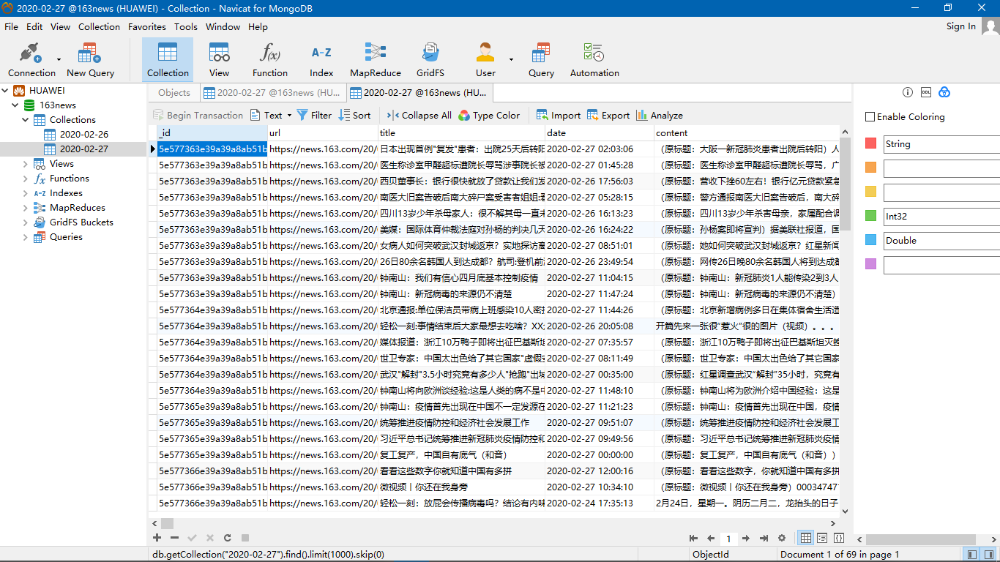

### 运行环境
- Python 3.7.6
- Scrapy 1.8.0

### 已完成的网站
- 网易新闻

### 运行
#### 运行某个爬虫
```
git clone https://github.com/zouyi9807/News-spider.git
cd News-spider/
pip install -r requirements.txt
scrapy crawl 163news
```
#### 运行脚本
或者你也可以通过运行爬虫项目目录下的 run.sh 或者 run.py 来启动所有爬虫，爬取的数据存储在该目录下，你可以选择保存为 CSV 或 JSON 格式。
```
pip install -r requirements.txt
python run.py / sh run.sh
```

### 写入MongoDB
**首先将 `163news\netease\netease\settings.py` 文件内的 `mongo_host、mongo_port、mongo_db_name` 改成相应配置**，另外如果你的 MongoDB 没有配置密码的话，需要将 `163news\netease\netease\pipelines.py` 文件内的 `db.authenticate()` 注释，之后就可以将数据爬取到 MongoDB 了。  

